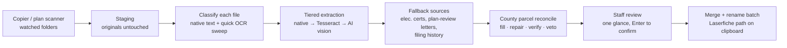

# Permit Scanning Assist

[](https://github.com/willluon/Permit-Scanning-Assist/actions/workflows/ci.yml)

A desktop tool built for the **Town of Yorktown Building Department** that automates the intake of scanned building permits into the department's document management workflow. In daily production use since June 2026 and under active development.

**The problem:** every scanned permit batch used to require a staff member to open the PDF, read the permit number, address, and Section-Block-Lot parcel ID off the page (often handwritten), rename the file by hand, and navigate a deep alphabetical folder tree in Laserfiche to file it. This tool reduces that to: scan, glance at the extracted fields, press Enter, drag one file.

---

## By the Numbers (as of Aug 2026)

- **~150 permit batches filed** through the app since June 2026, in live daily use
- **870+ scanned documents** OCR'd and archived into a searchable full-text index
- **10,817 pages** across 1,222 historical PDFs classified in a ground-truth census used to measure extraction accuracy and select data sources (see [Measuring Accuracy](#measuring-accuracy-instead-of-assuming-it))
- **14,407 county parcels** (the entire Town) cross-validate every extracted address and SBL
- **96 regression tests**, pure logic, run in under a second with no API/OCR/GUI dependencies
- **~1¢ of AI API cost per batch** worst case (down from ~12¢ before caching and skip logic), ~0¢ for clean printed permits

---

## Architecture



Every extracted value carries a **source rank** (manual > county > native text > Tesseract > AI > handwriting-OCR/fallbacks). Higher-rank sources can never be overwritten by lower-rank ones arriving later — and a user-typed value outranks everything.

---

## What It Does

When a permit batch is scanned, the tool:

1. **Watches scan folders** (user-configurable in the UI; add/remove/pause per folder) for incoming PDFs and plan images
2. **Stages copies** to a staging folder — originals are never moved or deleted
3. **Extracts three fields** through a tiered pipeline with early exit (native PDF text → Tesseract OCR → AI vision fallback):
   - **Permit ID** — 8 digits plus an optional suffix (`DEMO`, `FD`, …)
   - **Property Address** — fuzzy-matched against a validated Yorktown street list
   - **SBL** — Section-Block-Lot parcel identifier (e.g. `48.11-1-11`)
4. **Cross-checks against county parcel data** (all 14,407 Yorktown parcels from the NYS GIS assessment roll):
   - Fills a missing SBL from the address, or a missing address from the SBL
   - Repairs OCR-mangled SBLs (`2710-3-34` → `27.10-3-34`, dropped zero-padding, lost leading digits — the last only with address corroboration)
   - Repairs garbled street reads via the SBL when the street numbers agree (`3269 STO` → `3269 STONY ST`)
   - Flags conflicts for review instead of guessing; logs `Verified against county parcels` on a clean pass
   - **Vetoes** machine-read values that resolve to no real parcel or street — they are dropped and logged, never displayed
5. **Falls back to secondary documents** in the batch when fields are still missing — electrical inspection certificates (SBL + site address), plan-review letters (address), and the department's own filing history — all flagged `←verify` and never allowed to override a primary source
6. **Archives the full text** of every scan into an FTS5-indexed database — nothing is thrown away after extraction
7. **Merges the batch** into a single PDF in filing order (permit → application → plans → cover sheet), fixes upside-down pages, renames it `{PermitID}.pdf`, and copies the exact Laserfiche folder path to the clipboard

The staff member then drags one file into Laserfiche and pastes the pre-built path — no typing, no navigation.

---

## Measuring Accuracy Instead of Assuming It

The distinguishing engineering work in this project is that extraction sources were **chosen and constrained based on measured ground truth**, not intuition:

- **Page census** — `census_scans.py` classified all 10,817 pages of the historical scan folders (resumable, sharded, ~16 min on an office desktop), then an AI labeling pass (~$5 total) cataloged the long tail into a document-type inventory: insurance certificates, correspondence, electrical certs, plan-review letters, structural reports, and more.
- **Answer-key mining** — PDFs containing an official printed permit were used as ground truth to evaluate every *other* document type in the same file as a potential data source. This is how the fallback tiers earned their place:
  - Plan-review letters: address agreed with the official permit in **91/99 files (92%)** — admitted, address only
  - Electrical certificates: SBL usable after county validation; permit numbers agreed only 20/23 with plausible one-digit-off failures — **admitted for SBL/address, permit numbers logged as suggestions only** (an unvalidatable field with a silent-corruption failure mode stays out)
  - Application forms: permit ID machine-readable in only 3/198 files — confirmed the early decision to skip them for regex extraction; they now get an AI-vision last resort instead
  - Insurance certificates (~780 pages): contain a contractor-address trap and no parcel fields — **contribute nothing, by rule**
- **Guardrails for every fallback tier**: lowest source rank, fill-only-never-override, per-type field whitelists anchored to printed labels, county parcel DB as gatekeeper, and cross-document conflicts warn instead of fill.

The same skepticism is pinned in the test suite: the reconcile tests exist because a "repair" that uniquely suffix-matched a misread SBL to an unrelated parcel once produced a *confidently wrong* answer in practice. That failure mode is now a regression test, and repairs require corroboration.

---

## Document Types Supported

| Type | Role | Extraction |
|------|------|-----------|
| Official Building Permit (printed) | Primary source | Native text → Tesseract → AI vision (fast tier) |
| Orange folder cover sheet (handwritten) | Primary when no printed permit | Tesseract → AI vision (high-accuracy tier, 3× zoom) |
| Application forms (all permit types) | Last resort | AI vision on the form front, suggestion-flagged |
| Electrical inspection certificates | Fallback | Label-anchored regex: site address + SBL only |
| Plan-review letters | Fallback | Address only |
| Plans / oversized sheets, images | Filed, never OCR'd | Detected by page size and paper color |

Permit subtype (Building, Electrical, Demolition, …) is detected and shown in the UI.

---

## UI Features

### Main Window
- **Source labels** on every field: `text` (native PDF), `ocr` (Tesseract), `ai ←verify`, `ocr?` (handwriting), `cert`/`plan`/`hist ←verify` (fallback tiers), `county` (parcel-verified), `manual` (user-typed — outranks all)
- **SBL validator** — red for malformed, orange for well-formed but not a real Yorktown parcel
- **Staged Batch panel** — every staged file with a type tag and per-file remove
- **Live page preview** during OCR; click it to open the scan
- **Scan watcher panel** — add/remove/pause watched folders without touching code
- **Keyboard shortcuts** — `Enter` confirm, `N` new permit, `R` re-OCR
- Daily / 7-day scan stats; window position remembered between runs

### Lookups
- **History** — every filing with live search, sortable columns, load-back-into-form
- **Full-text search** — FTS5 over the complete OCR text of every scan ("asbestos", a contractor name, …) with snippets, final filename, and Laserfiche path on each hit
- **Property lookup** — search by address, SBL or prefix, bare street number, or owner; shows every scan on file for the parcel and its Laserfiche path; one click fills the form with county-verified data

### Safety
- **Archive-backed duplicate detection** — filing a permit ID that was filed before prompts with the prior date, filename, and status (revision-aware: asks, never blocks)
- **Manual edits are sacred** — a user-typed value can never be overwritten by a late OCR result
- Originals in the scan folders are never modified; staging copies are the only thing renamed or merged

---

## Engineering Notes

- **Cost engineering**: AI vision responses are content-hash cached (same page + model = free forever), and once a batch is county-verified the AI call is skipped entirely. Practice runs and re-OCRs cost nothing.
- **Structured outputs**: extraction calls use JSON-schema-constrained responses — no prose preambles, no fence-stripping, no truncated JSON.
- **Validation beats rank**: a garbage OCR read that resolves to no real parcel cannot block a lower-ranked AI read that does resolve.
- **Model tiering**: a fast model reads printed permits at 2× zoom; a stronger model reads handwriting at 3× zoom. Oversized plan pages are re-rendered to fit API image limits.
- **Upside-down scans**: a page-1 that reads as nothing gets flipped 180° and re-checked inline before any later page is trusted; confirmed batches get a full orientation sweep so the filed copy is upright.
- **Resilience**: app restarts recover the staging state; already-confirmed files are recognized and never re-armed into the next batch; final renames can't overwrite a prior filing sitting in staging.

---

## Tech Stack

- **Python 3 / tkinter** — runs on existing department Windows machines, no installs beyond Python + Tesseract
- **PyMuPDF (fitz)** — PDF rendering, native text, page rotation, merging
- **Tesseract OCR** — local OCR, plus OSD for orientation detection
- **Claude API** — vision fallback (fast tier for print, high-accuracy tier for handwriting), JSON-schema structured outputs
- **SQLite** — county parcel DB, FTS5 full-text archive, AI response cache; all local files, no server

---

## Laserfiche Integration (designed, awaiting approval)

Filing is currently drag-and-drop plus a clipboard path. Direct integration with the Town's self-hosted Laserfiche server was scoped end-to-end — REST API upload via a least-privilege service account, metadata template population, human-in-the-loop rollout with a test folder and rollback plan — and a process document was prepared for the Town's managed IT provider and finance. Server-side installation is pending organizational approval; the application is built so the manual filing step is the only thing that changes when it lands. A backfile-digitization batch mode (historical paper permits → review queue → auto-file) is designed to follow it.

---

## Repository Contents

| File | Purpose |
|------|---------|
| `permit_scan.py` | Main application — GUI, pipeline, reconcile, lookups |
| `build_parcel_db.py` | Builds the county parcel DB from the NYS GIS tax-parcel service (re-run yearly) |
| `census_scans.py` | Ground-truth page census over historical scan folders (sharded, resumable) |
| `census_report.py` | Document-type catalog report over the census DB |
| `yorktown_streets.txt` | Validated Yorktown street list for fuzzy matching |
| `tests/` | Regression tests — see below |

### Tests

```
python -m unittest discover -s tests -v
```

96 tests, under a second, no API/OCR/GUI. They cover classification, field extraction, street normalization, Laserfiche path building, source ranking, staging-filename rules, telemetry sanitization (the metrics schema is pinned so no column can ever carry document content), and — most importantly — the county-reconcile guardrails that keep the tool from "repairing" a misread into a confidently wrong parcel. Tests named `test_KNOWN_LIMITATION_*` pin accepted-but-undesired behavior; they mark what to revisit, not what to trust. Tests needing the parcel DB skip themselves when it's absent.

### Local Data Files (not in repo)

| File | Purpose |
|------|---------|
| `~\yorktown_parcels.db` | County parcels: SBL ↔ address ↔ owner |
| `~\permit_scan_archive.db` | Full-text scan archive (FTS5) + AI response cache |
| `~\permit_scan_history.json` | Filing history |
| `~\permit_scan_config.json` | Watch folders, API key, window position |
| `~\permit_census.db` | Page census / document-type ground truth |

---

*Built for internal use by the Town of Yorktown Building Department. Actively developed.*
